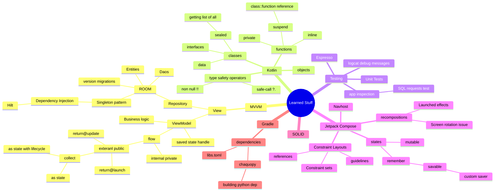

# Sharks' Empire: English

  

  

> ### An English Learning app for windows in a form of flashcards.
>  Provides words upto B2 level of English without the need for subscription

## Table of contents

-  [Screenshots](#camera-Screenshots)
-  [Key Features](#Key-Features)
-  [Installation](#Installation)
-  [Tweaking project](#How-to-tweak-project-for-your-own-needs)
-  [Credits](#Credits)

## :camera: Screenshots

    &nbsp;&nbsp;&nbsp;&nbsp;

  Show more screenshots

## Key Features

There are three modes Overview Practice and Exam.
While overview just straight up shows the translation others provide it after pressing a designated button.
In the end all mistakes are shown as so to provide you with a feature to reflect on your answers.
To gauge the progress of learning each word they have points assigned to them.
When you are ready - complete the exam: a more strict area which punishes mistakes more.
The exam goal is to make as few mistakes as possible
But in order to not be utterly strict it allows one mistake to be completed

✅**The features of an app are as follows:**
- 1️⃣**Only one part of speech per group, less confusion**
- 📦**Groups consist of subgroups**
- 🧮**Mostly just 10 words per subgroup** flashcards organised into quite small groups for easier memorization.
- 🎯**self evaluation** We don't put a goal of checking your typing speed or pronunciation, thus it's your responsibility to evaluate the answer. We also wanted to reduce guessing factor which `four options` introduces so if you see that your translation didn't align with given one - press a `wrong answer` button
- 🌊👋.**context-sensitive translations** it aims to show beginner how words meanings can vary depending on context
- 🗣️**target learner language Russian**
> (**you can provide your own translations for db**) [Example](#add-your-vocabulary-or-locale)

## Credits

This software uses the following packages and resources:

* uses Kokoro tts from [This repository](https://github.com/hexgrad/kokoro)

