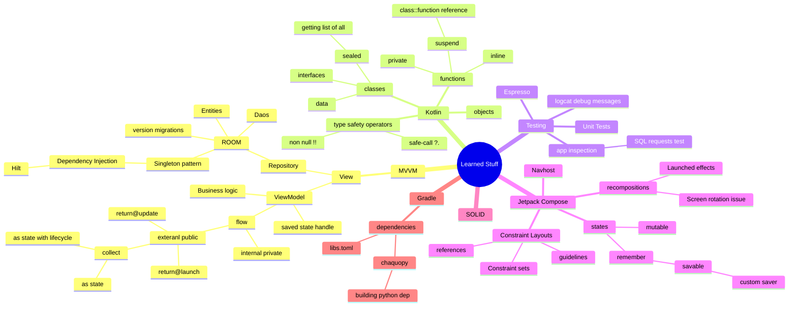

```mermaid
---
config:
  kanban:
    ticketBaseUrl: 'https://github.com/mermaid-js/mermaid/issues/#TICKET#'
---
kanban
[✅Chosing framework]
[Chaquopy]@{ priority: "Very High"}
[QT for android]@{ priority: "Very High"}
[Jetpack Compose]@{priority: "Low"}
[✅Groups screen]
[Groups view]@{ priority: "Low"}
[Prepopulated db]@{ priority: "Low"}
[Add raw queries]@{ priority: "Low"}
[✅Screen switch logic]
[Added screen state]@{ priority: "Low"}
[Screen LaunchedEffects]@{ priority: "Low"}
[Mode selector screen]@{ priority: "Low"}
[Lesson screen]@{ priority: "Low"}
[✅Lesson Screens]
[View for each mode]@{ priority: "Low"}
[Lesson ConstraintLayout]@{ priority: "Low"}
[Lesson logic]@{ priority: "Low"}
[Summary screen]@{ priority: "Low"}
[Summary logic]@{ priority: "Low"}
[✅Enhancing Lesson]
[Buttons appearance]@{ priority: "Low"}
[Progress indicators]@{ priority: "Low"}
[Smart shuffling logic]@{ priority: "Low"}
[Clear lesson restart]@{ priority: "Low"}
[Added data classes]@{ priority: "Low"}
[✅Gui quality updates]
[Added my TextStyles]@{ priority: "Low"}
[Scrollable text fields]@{ priority: "Low"}
[Device Rotation fix]@{ priority: "Low"}
[More progress bars]@{ priority: "Low"}
[Float vals fix]@{ priority: "Low"}
[Sound consistency]@{ priority: "Low"}
```

```mermaid
mindmap
root((Learned Stuff))
  MVVM
    View
      ViewModel
        Business logic
        flow
          internal private
          exteranl public
            return@launch
            return@update
            collect 
              as state
              as state with lifecycle
        saved state handle
      Repository            
        ROOM 
          Entities
          Daos
          Singleton pattern
            Dependency Injection
              Hilt
          version migrations
  Kotlin
    type safety operators
      non null !!
      safe-call ?.
    objects
    classes
      sealed
        getting list of all
      data
      interfaces
    functions
      private
      inline
      suspend
        class::function reference
  Testing
    Unit Tests
    Espresso
    app inspection
      SQL requests test
    logcat debug messages
  Jetpack Compose
    Navhost
    states
      mutable
      remember
        savable
          custom saver
    recompositions
      Screen rotation issue
      Launched effects
    Constraint Layouts
      references
      Constraint sets
      guidelines
  SOLID
  Gradle
    dependencies
      libs.toml
      chaquopy
        building python dep

```
